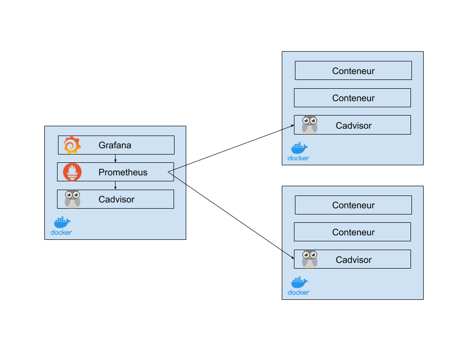

# Docker Monitoring
Mise en place des outils pour monitorer des conteneurs Docker:
* cAdvisor : https://github.com/google/cadvisor
* Prometheus : https://prometheus.io
* Grafana : https://grafana.com

## Schéma



# cAdvisor

cAdvisor doit être installé sur chacun des Docker que l'on veut monitorer. Celui-ci s'intalle dans un conteneur. Pour lancer cAdvisor, 2 propositions en fonction de votre installation Docker :
## En service

```
$ sh cadvisor-service.sh
```

## En container

```
$ sh cadvisor-container.sh
```

## Interface

Une interface web est disponible à l'adresse : 

```
http://<adresse du serveur>:8181/
```

# Prometheus et Grafana :

Un fichier docker-compose est disponible dans PrometheusGrafana. Ajouter dans le fichier prometheus.yml les serveurs cadvisor installés :

```
  - job_name: 'cadvisor'
    scrape_interval: 5s
    static_configs:
      - targets: ['<adresse du server cAdvisor>:8181']
```

# Dashboard Grafana
*  https://grafana.com/grafana/dashboards/11600
